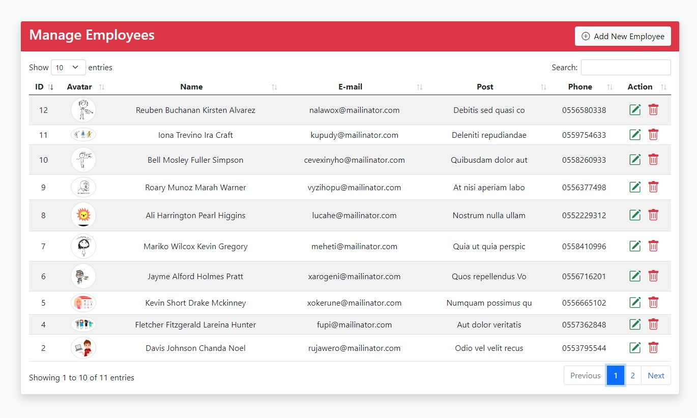
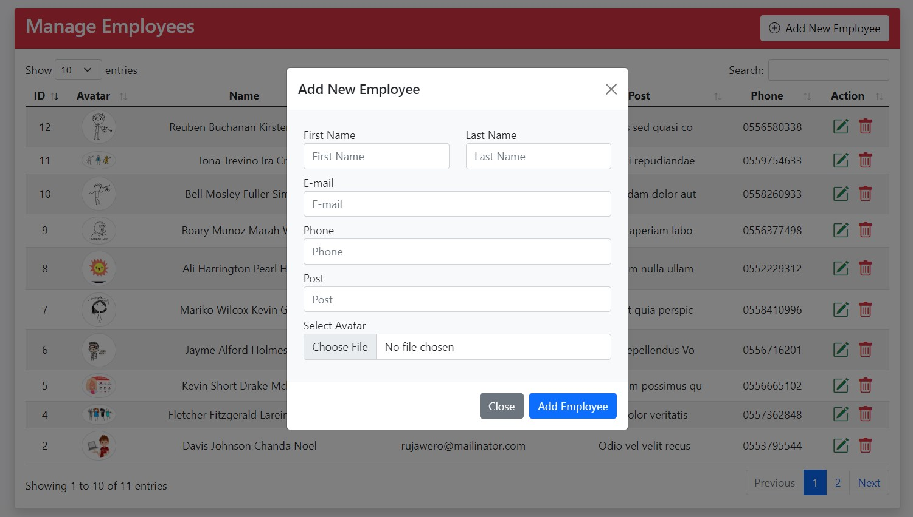
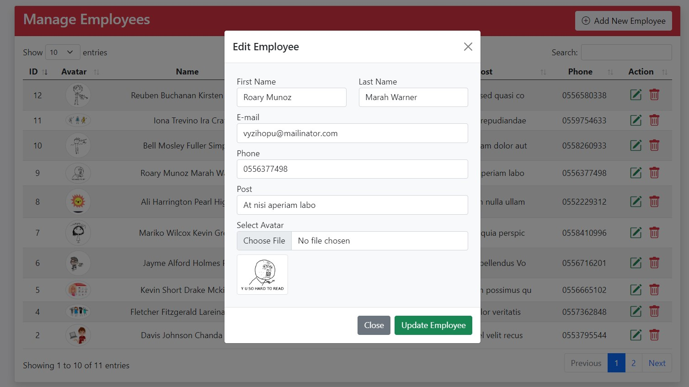
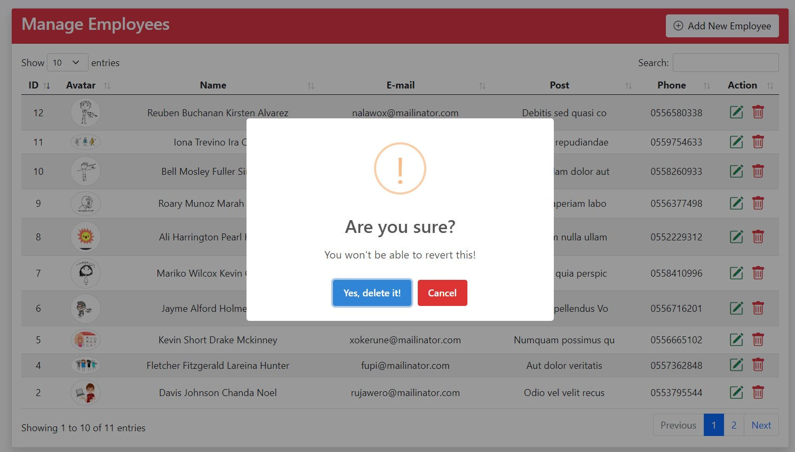

# CRUD Application With Image Upload Using Laravel 11

This is a simple CRUD (Create, Read, Update, Delete) application built with Laravel 11, jQuery - Ajax, SweetAlert, and DataTable. It allows users to perform CRUD operations on a database table and upload images for each item.

## Features

- **CRUD Operations:** Create, Read, Update, and Delete records.
- **Image Upload:** Upload images for each item.
- **Dynamic Loading:** Data loaded dynamically using jQuery Ajax.
- **User-Friendly Alerts:** Beautiful alert messages using SweetAlert.
- **Data Presentation:** Use DataTable for data presentation and manipulation.

## Requirements

- **PHP:** >= 8.2
- **Composer**
- **Laravel 11**
- **SQLite** database
- **Web Server:** (Apache, Nginx, etc.)

## Installation

1. **Clone the repository:**

    ```bash
    git clone https://github.com/ishado/crud-ajax.git
    ```

2. **Navigate to the project directory:**

    ```bash
    cd project-directory
    ```

3. **Install composer dependencies:**

    ```bash
    composer install
    ```

4. **Copy `.env.example` to `.env` and configure your database credentials:**

    ```bash
    cp .env.example .env
    ```

5. **Update the following lines in `.env` file to use SQLite:**

    ```plaintext
    DB_CONNECTION=sqlite
    # DB_HOST=127.0.0.1
    # DB_PORT=3306
    # DB_DATABASE=laravel
    # DB_USERNAME=root
    # DB_PASSWORD=
    ```

6. **Create an empty SQLite database file:**

    ```bash
    touch database/database.sqlite
    ```

7. **Run database migrations to create required tables:**

    ```bash
    php artisan migrate
    ```

8. **Serve the application:**

    ```bash
    php artisan serve
    ```

9. **Access the application in your web browser at `http://localhost:8000`.**

## Usage

- **Navigate to the application in your web browser.**
- **Perform CRUD operations using the provided interface.**
- **Upload images for each item.**
- **Enjoy the smooth interaction and beautiful interface provided by SweetAlert and DataTable.**

## Screenshots






## Credits

- **Laravel** - [https://laravel.com/](https://laravel.com/)
- **jQuery** - [https://jquery.com/](https://jquery.com/)
- **SweetAlert** - [https://sweetalert2.github.io/](https://sweetalert2.github.io/)
- **DataTable** - [https://datatables.net/](https://datatables.net/)

## License

Check out the source tutorial [here](https://dcodemania.com/post/crud-application-image-upload-laravel-8-ajax-sweetalert-datatable).
This project is open-source software licensed under the [MIT license](https://opensource.org/licenses/MIT).
